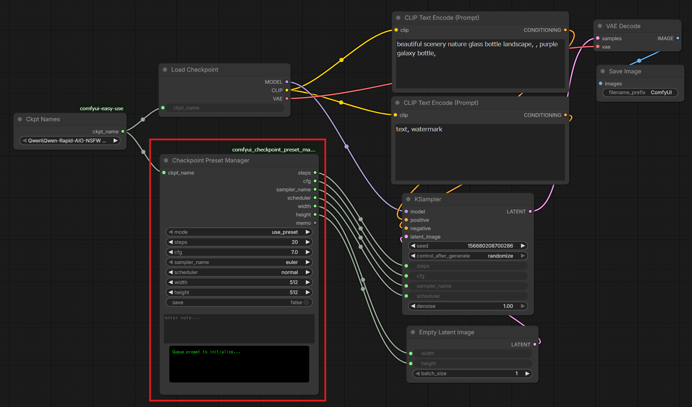

# ComfyUI Checkpoint Preset Manager

A custom node for ComfyUI designed to manage and automate optimal settings for different Checkpoints. It allows you to save and recall specific parameters—including steps, CFG, samplers, schedulers, and resolutions—linked directly to the model name.



## Overview
Tired of re-entering the "sweet spot" settings every time you switch models? This node automates that process. It stores your preferred configurations in a local JSON file and restores them instantly when the corresponding Checkpoint is loaded. It also features a dedicated "Memo" section to keep track of specific prompts or usage notes for each model.

## Key Features
* **Model-Specific Presets**: Automatically saves and loads settings based on the `ckpt_name`.
* **Resolution Management**: Includes `width` and `height` in the preset for seamless resolution switching.
* **Smart & Compact UI**:
    * **Multi-line Memo Area**: A spacious text area for jotting down notes or trigger words.
    * **Live Status Display**: A dedicated "Status Board" (black console style) that provides real-time feedback on mode and save status.
    * **Refined Layout**: Custom CSS integration to ensure the UI elements are tightly packed and visually organized.
* **Persistent Storage**: Settings are stored in a simple `presets.json` file for easy backup or manual editing.

## Installation

1. Navigate to your ComfyUI `custom_nodes` directory.
2. Clone this repository:
   ```bash
   git clone https://github.com/TakkunRed/comfyui_checkpoint_preset_manager.git

3. Restart ComfyUI.

## How to Use
1. Saving a New Preset
    * Set the mode to use_ui.
    * Connect your Load Checkpoint node to the ckpt_name input.
    * Adjust the parameters (Steps, CFG, etc.) and type your notes in the memo box.
    * Set save to true and click Queue Prompt.
    * The status board will change color and display (SAVED!).

2. Loading an Existing Preset
    * Set the mode to use_preset.
    * Whenever you change the Checkpoint, the node will automatically look up the saved values.
    * The status board will display the currently active preset values.

## Node Input/Output
1. Inputs
    * ckpt_name: The name of the model (linked to the preset).
    * steps, cfg, sampler_name, scheduler: Core generation parameters.
    * width, height: Preferred resolution.
    * memo: Notes or reminders for the model.

2. Outputs
    * steps, cfg, sampler_name, scheduler, width, height, memo: The active values to be passed to other nodes (like KSampler or Empty Latent Image).

## File Structure
* checkpoint_preset.py: Main node logic and backend processing.
* web/checkpoint_preset.js: UI customization and front-end layout control.
* presets.json: The database where your settings are stored (auto-generated).

## License
This project is licensed under the MIT License.